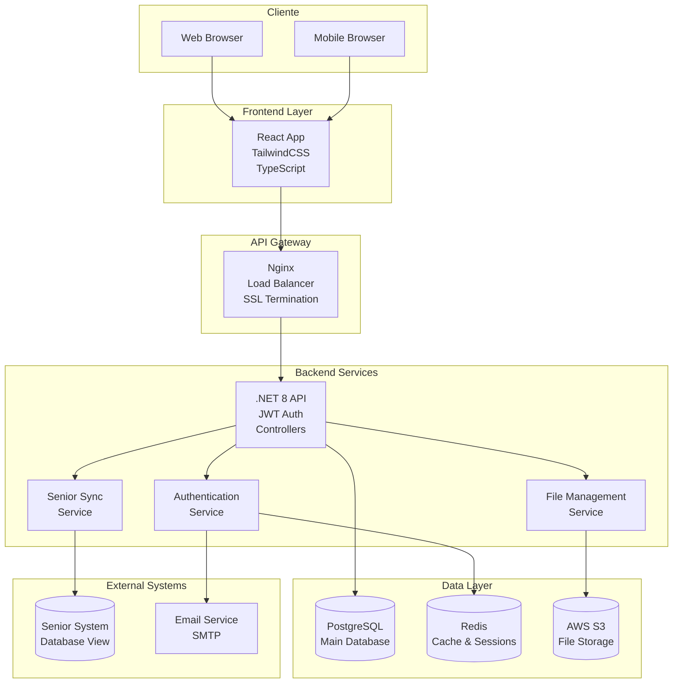

# Arquitetura do Sistema Acervo Educacional

## Visão Geral da Arquitetura

O Sistema Acervo Educacional foi projetado seguindo os princípios de arquitetura limpa e separação de responsabilidades, utilizando uma abordagem de microserviços com comunicação via APIs RESTful.

## Diagrama de Arquitetura de Alto Nível



## Camadas da Aplicação

### 1. Camada de Apresentação (Frontend)

**Tecnologias:**
- React 18+ com TypeScript
- TailwindCSS para estilização
- React Router para navegação
- Axios para comunicação HTTP
- React Hook Form para formulários
- Video.js para player customizado

**Responsabilidades:**
- Interface do usuário responsiva
- Validação de formulários no cliente
- Gerenciamento de estado local
- Comunicação com APIs backend
- Implementação de recursos de proteção de conteúdo

### 2. Camada de API (Backend)

**Tecnologias:**
- .NET 8 com ASP.NET Core
- Entity Framework Core
- AutoMapper
- FluentValidation
- Serilog para logging

**Responsabilidades:**
- Exposição de APIs RESTful
- Autenticação e autorização JWT
- Validação de dados de entrada
- Orquestração de serviços
- Logging e monitoramento

### 3. Camada de Serviços

**Serviços Principais:**

#### AuthenticationService
- Gerenciamento de usuários
- Autenticação JWT
- Recuperação de senha
- Controle de sessões

#### CourseService
- CRUD de cursos
- Movimentação no Kanban
- Validações de negócio
- Gerenciamento de comentários

#### FileService
- Upload para S3
- Geração de URLs assinadas
- Controle de acesso
- Categorização de arquivos

#### SyncService
- Sincronização com Senior
- Agendamento via Hangfire
- Mapeamento de dados
- Tratamento de conflitos

### 4. Camada de Dados

**PostgreSQL - Banco Principal:**
- Dados de usuários e cursos
- Metadados de arquivos
- Logs de auditoria
- Configurações do sistema

**Redis - Cache e Sessões:**
- Cache de consultas frequentes
- Sessões de usuário
- Dados temporários
- Rate limiting

**AWS S3 - Armazenamento de Arquivos:**
- Arquivos educacionais
- Backups automáticos
- Versionamento
- CDN integration

## Padrões de Design Utilizados

### Repository Pattern
Abstração da camada de acesso a dados, facilitando testes e manutenção.

```csharp
public interface ICourseRepository
{
    Task<Course> GetByIdAsync(Guid id);
    Task<IEnumerable<Course>> GetAllAsync();
    Task<Course> CreateAsync(Course course);
    Task UpdateAsync(Course course);
    Task DeleteAsync(Guid id);
}
```

### Unit of Work Pattern
Gerenciamento de transações e coordenação entre repositórios.

```csharp
public interface IUnitOfWork
{
    ICourseRepository Courses { get; }
    IFileRepository Files { get; }
    IUserRepository Users { get; }
    Task<int> SaveChangesAsync();
}
```

### CQRS (Command Query Responsibility Segregation)
Separação entre operações de leitura e escrita para melhor performance.

### Dependency Injection
Inversão de controle para facilitar testes e manutenibilidade.

## Segurança

### Autenticação JWT
- Tokens com expiração configurável
- Refresh tokens para renovação
- Claims customizadas para autorização

### Proteção de Arquivos
- URLs assinadas com expiração
- Controle de acesso por domínio
- Watermarking para vídeos
- Bloqueios de interação

### Validação e Sanitização
- Validação de entrada em todas as camadas
- Sanitização de dados do usuário
- Proteção contra SQL Injection
- Validação de tipos de arquivo

## Performance e Escalabilidade

### Caching Strategy
- Cache de consultas frequentes no Redis
- Cache de arquivos estáticos via CDN
- Cache de metadados de arquivos

### Otimizações de Banco
- Índices otimizados para consultas frequentes
- Paginação para listagens grandes
- Queries otimizadas com Entity Framework

### Streaming de Arquivos
- Upload progressivo para arquivos grandes
- Streaming de vídeos com Video.js
- Compressão automática de imagens

## Monitoramento e Observabilidade

### Logging
- Logs estruturados com Serilog
- Correlação de requests
- Logs de auditoria para ações sensíveis

### Métricas
- Performance de APIs
- Uso de recursos
- Estatísticas de acesso a arquivos

### Health Checks
- Verificação de saúde dos serviços
- Monitoramento de dependências externas
- Alertas automáticos

## Deployment e DevOps

### Containerização
- Docker para aplicação
- Docker Compose para desenvolvimento
- Kubernetes para produção

### CI/CD Pipeline
- Build automatizado
- Testes automatizados
- Deploy blue-green
- Rollback automático

### Ambientes
- Desenvolvimento local
- Ambiente de teste
- Staging
- Produção

## Integração com Sistemas Externos

### Sistema Senior
- Conexão via view de banco
- Sincronização agendada
- Mapeamento de dados
- Tratamento de erros

### AWS Services
- S3 para armazenamento
- CloudFront para CDN
- SES para emails
- CloudWatch para monitoramento

### Email Service
- Recuperação de senha
- Notificações do sistema
- Templates personalizados

## Considerações de Backup e Recuperação

### Backup de Dados
- Backup diário do PostgreSQL
- Replicação de dados críticos
- Backup incremental de arquivos S3

### Disaster Recovery
- Plano de recuperação documentado
- Testes regulares de restore
- RTO/RPO definidos

### Versionamento
- Versionamento de arquivos no S3
- Histórico de alterações no banco
- Rollback de versões anteriores

